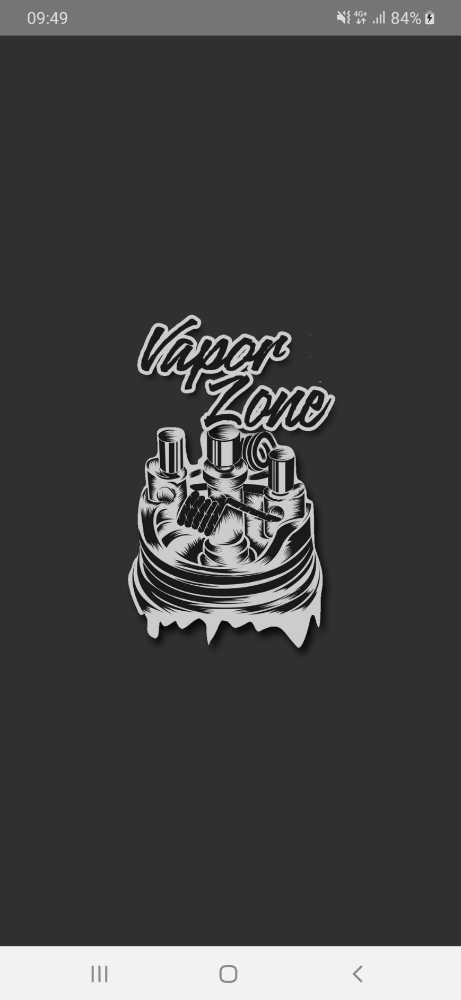
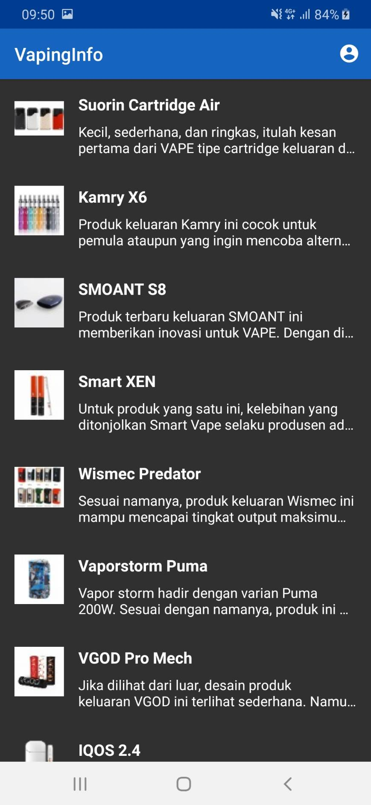
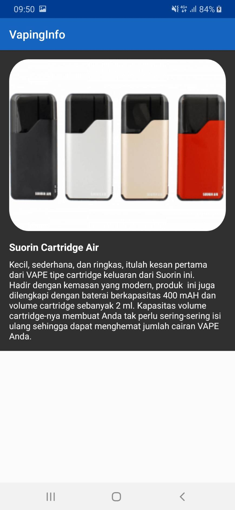
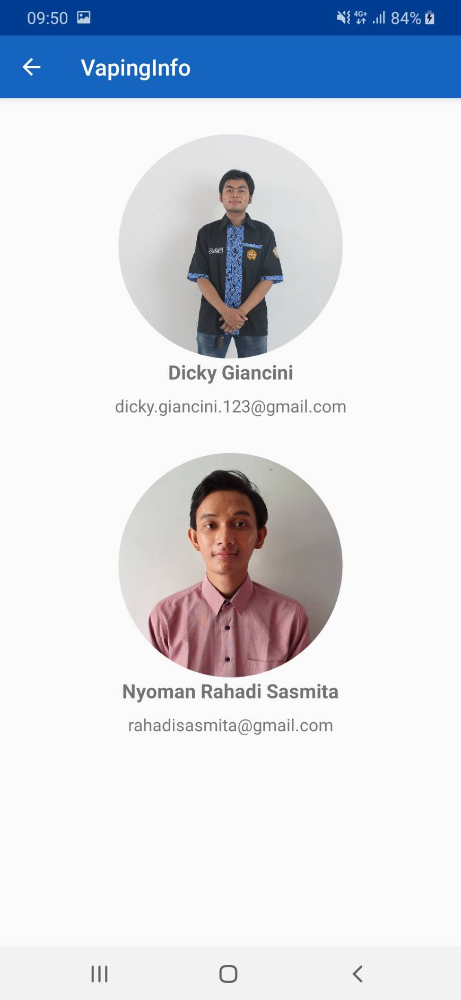

# VapingInfo
Berikut adalah user manual dari penggunaan aplikasi VaporZone
 
1. Tampilan awal untuk splash screen, tunggu selama 4 detik 

2. Membuka menu list dari data vapor yang tersedia, bisa discroll up, down 

3. Setelah itu tekan salah satu informasi, maka informasi lengkap mengenai data tersebut akan muncul pada activity baru 

4. Kemudian Apabila anda menekan logo profil pada tampilan utama, maka akan menampilkan informasi developer aplikasi tersebut 

